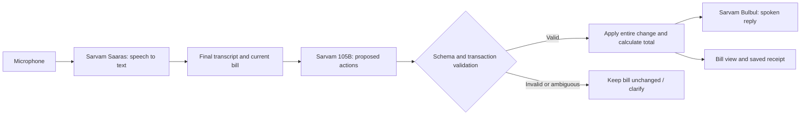

<div align="center">


# Rush Hour

### Bolke bill banao. Speak an order. Get the bill.

A voice-first billing prototype for small food counters, powered by Sarvam AI.

[MIT license](LICENSE) · [Mac setup](mac-agent/README.md) · [Browser lab](docs/WEB_LAB.md) · [Contribute](CONTRIBUTING.md)

</div>

---

## Why Rush Hour?

At a busy counter, the person taking orders may also be making chai, serving food, and collecting payment. Rush Hour explores a simple question: **can they create and correct a bill just by speaking?**

Say an order in Hindi, Marathi, English, or a mix of languages. The assistant interprets it, applies validated changes to the current bill, and announces the amount. The language model interprets intent; application code owns the menu prices and arithmetic.

This repository contains a **native macOS counter assistant** and a **browser evaluation lab**. They share a product idea, but use separate implementations and separate state. The Mac app is the current hands-free prototype; the browser lab makes order changes and failure cases inspectable.

> **Early prototype, not a production POS.** Android, Windows, receipt printing, wake-word activation, and actual payment collection are not implemented. Language quality and reliability in noisy shops still need systematic field testing. This is an independent project, not an official Sarvam product.

## The experience

With a Sarvam key connected, click the Mac menu-bar icon or reopen the app from the Dock. It asks **“What would you like to order?”** without opening a panel.

| You say | What happens |
| --- | --- |
| “Do chai, ek samosa.” | Two chai and one samosa: **₹60** |
| “Ek chai hatao.” | Remove one chai: **₹40** |
| “Total kitna hua?” | Announces **₹40**; keeps the bill open |
| “Next customer.” | Saves the completed ₹40 bill and starts an empty one |
| “Undo.” | Restores the previous bill snapshot |

These are example interactions for the included sample menu, not published speech-accuracy results. A limited no-key demo reproduces the order/correction flow without calling Sarvam.

Right-click the icon for **View bill**, **Pause listening**, and **Connection settings**. The assistant stays available when the bill window is closed, while the Mac is awake.

## What is available today?

| Capability | Native Mac assistant | Browser lab |
| --- | --- | --- |
| Voice input | Continuous realtime streaming with automatic turn detection | Push-to-talk or audio upload |
| Order workflow | One current customer's bill | Multiple named customer tickets |
| Corrections and exact menu totals | Yes | Yes |
| Spoken replies | Sarvam Bulbul; system voice for the activation prompt | Sarvam Bulbul |
| Undo | In-memory snapshots, including checkout | In-memory snapshots |
| Storage | Current bill and last 50 completed bills on the Mac | Per-tab state; JSON export |
| Inspection | Recent turns and text receipt export | Event traces and 12 text evaluation scenarios |
| Printer support / payments | Not implemented | No actual payment processing |
| Phone / Windows app | Not implemented | Foreground browser lab only |

## Quick start: Mac assistant

Requires **macOS 14+** and Apple's Xcode Command Line Tools. The native app has no third-party package dependencies. Node.js is not needed for this version.

```sh
git clone https://github.com/pratik-mahalle/rush-hour.git
cd rush-hour
./mac-agent/build.sh
open "mac-agent/build/Rush Hour Counter.app"
```

The build targets the architecture of the Mac running the command and creates a locally ad-hoc-signed app. This repository does not include a notarized installer or prebuilt app binary.

1. Right-click the Rush icon → **Connection settings**.
2. Enter your own [Sarvam API key](https://dashboard.sarvam.ai/). The app stores it in macOS Keychain.
3. Click the Rush icon and allow microphone access when macOS asks.
4. Wait for the order prompt, then speak. Use the examples above.
5. Right-click → **Pause listening** to stop the microphone and cancel pending work.

Without a key, the icon speaks setup instructions. To explore without connecting Sarvam, open **Connection settings → Use demo** and use the example buttons in the bill window. Demo mode does not record audio or make API calls, and it does not overwrite saved live bills.

See the [Mac guide](mac-agent/README.md) for storage, menu customization, and listening behavior.

## Quick start: browser lab

Requires **Node.js 22.13+** and npm. This is a React application using Vinext, Vite, and the Cloudflare local Workers runtime; local use does not require a Cloudflare account.

```sh
npm ci
npm run dev
```

Open `http://localhost:5191`. Choose **Run the rush** for a no-key demo, or **Break my agent** to run the 12 text scenarios. Connect your own Sarvam key in the UI for live speech and free-form interpretation.

The browser is useful for trying the workflow and inspecting transactions. It is not a background phone assistant. See [the browser lab guide](docs/WEB_LAB.md) for supported actions and evaluation limits.

## How it works



**Speech:** The Mac app converts microphone audio to 16 kHz mono PCM and streams it to Saaras v4. Server voice activity detection identifies complete turns; partial transcripts update the bill window. The browser lab instead submits short recordings through its server routes.

**Understanding:** Sarvam 105B receives the transcript, authoritative current state, and recent conversation. It proposes constrained actions such as adding, removing, or setting a quantity. A request for the total does not close the bill.

**Correctness:** The native app validates actions in Swift; the web lab uses Zod and a TypeScript reducer. Both validate a whole transaction before committing it. Unsupported menu items, impossible quantities, and ambiguous variants leave the bill unchanged. Prices come from the menu, never the model.

**Reply:** Bulbul speaks the result. The native app mutes microphone content during playback and briefly afterward to prevent feedback. This is half-duplex: talking over the reply is not supported.

**Cancellation:** Pausing the native assistant closes the speech connection, cancels pending requests and playback, and discards queued turns. Session guards prevent late responses from changing a newer bill.

## Sample menu

| Item | Price |
| --- | ---: |
| Masala chai | ₹20 |
| Samosa | ₹20 |
| Vada pav | ₹30 |
| Filter coffee | ₹35 |
| Bun maska | ₹35 |

The native menu is defined in [`mac-agent/Sources/Billing.swift`](mac-agent/Sources/Billing.swift), and the web menu in [`lib/domain.ts`](lib/domain.ts). There is no owner-facing menu editor yet. Existing saved native receipts use these menu definitions when calculating totals, so changing prices requires a receipt migration before real use.

## Privacy and API usage

- While native listening is active, surrounding microphone audio is streamed to Sarvam. There is no local wake-word gate yet. **Sarvam API usage is billed to your account.** Check [current pricing](https://docs.sarvam.ai/api/getting-started/pricing) before leaving it running.
- This application does not save raw audio. Provider-side retention is governed by Sarvam's terms and policies.
- Native credentials are held in macOS Keychain. Bills are saved locally; recent conversation and undo history stay in memory.
- The web key remains in tab memory and passes through the local/same-origin server to Sarvam. Refreshing clears the key and session state. Use a server you trust.
- Never commit API keys, real customer recordings, saved bills, or personal order transcripts. Synthetic fixtures are enough for most contributions.

## Tests and current evidence

```sh
# Native billing invariants; macOS only
./mac-agent/test.sh

# Web domain behavior, types, and production build
npm test
npm run typecheck
npm run build
```

The current automated suites contain **20 native billing checks** and **25 web domain tests**. They cover corrections, transaction rollback, quantity bounds, variant ambiguity, exact totals, state validation, and related order invariants. The browser's 12 evaluation scenarios are hand-authored **text scenarios**, not an audio benchmark.

The native demo flow has been exercised through the app UI. Live functionality depends on Sarvam credentials and model access. These checks do not establish end-to-end speech accuracy, response-time guarantees, or readiness for a noisy commercial counter. No shop deployments or field-performance claims are made here.

## Roadmap

- [ ] Test with shop owners and publish a consented evaluation methodology.
- [ ] Support one verified thermal receipt printer, including reprint and duplicate protection.
- [ ] Add a menu and price editor with historical receipt price snapshots.
- [ ] Add local activation to reduce unnecessary cloud audio streaming.
- [ ] Build Android or Windows support based on pilot shops' actual hardware.
- [ ] Provide daily summaries and explicit payment reconciliation.
- [ ] Package signed and notarized releases after real-device testing.

## Repository map

```text
mac-agent/          Native SwiftUI/AppKit assistant, build script, and billing tests
app/                Browser UI and Sarvam API routes
lib/                Web order engine, scenarios, and session orchestration
components/         Browser UI primitives
tests/              Web domain tests
docs/               Browser guide and architecture notes
.github/workflows/  Native and web CI checks
```

## Contributing

Bug reports, reproducible language examples, printer compatibility work, and platform contributions are welcome. Please read [CONTRIBUTING.md](CONTRIBUTING.md). For a good bug report, include the starting bill, exact synthetic instruction, expected result, and actual result—without credentials or customer data.

## License and acknowledgements

Released under the [MIT License](LICENSE). Built with Sarvam's speech and language APIs, Apple's native frameworks, React, Vinext, Vite, and Cloudflare's local runtime. Third-party dependencies retain their own licenses. The repository license does not grant rights to Sarvam's services or models.

Built by [Pratik Mahalle](https://github.com/pratik-mahalle).
